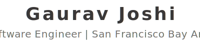

<!-- Profile header -->

  <picture>
    <source media="(prefers-color-scheme: dark)" srcset="assets/images/profile-header.dark.svg" />
    
  </picture>

<!-- Social media links -->

  <!-- LinkedIn -->
  <a href="https://www.linkedin.com/in/joshigaurava" title="LinkedIn">
    <picture>
      <source media="(prefers-color-scheme: dark)" srcset="assets/images/icons/linkedin.icon.dark.png" />
      
    </picture>
  </a>

  <!-- Padding -->
  <picture>
    
  </picture>

  <!-- Medium -->
  <a href="https://joshigaurava.medium.com" title="Medium">
    <picture>
      <source media="(prefers-color-scheme: dark)" srcset="assets/images/icons/medium.icon.dark.png" />
      
    </picture>
  </a>

  <!-- Padding -->
  <picture>
    
  </picture>

  <!-- Instagram -->
  <a href="https://www.instagram.com/joshigaurava" title="Instagram">
    <picture>
      <source media="(prefers-color-scheme: dark)" srcset="assets/images/icons/instagram.icon.dark.png" />
      
    </picture>
  </a>

